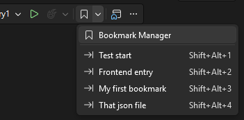
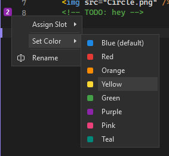
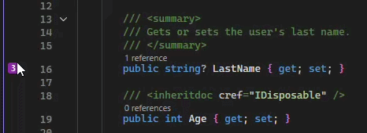

[marketplace]: <https://marketplace.visualstudio.com/items?itemName=MadsKristensen.BookmarkStudio>
[vsixgallery]: <https://www.vsixgallery.com/extension/BookmarkStudio.7ed28d42-37b3-4773-8a6e-e9ca6403a0fc>
[repo]: <https://github.com/madskristensen/BookmarkStudio>

# Bookmark Studio for Visual Studio

Download this extension from the [Visual Studio Marketplace][marketplace]
or get the latest CI build from [Open VSIX Gallery][vsixgallery].

--------------------------------------

Stop losing your place in large codebases. Bookmark Studio lets you mark, organize, and instantly jump to important locations in your code - across your entire solution.

## What You Get

**Instant navigation** - Press **Alt+Shift+1** through **Alt+Shift+9** to jump directly to your most important bookmarks. No searching, no scrolling.

**Visual organization** - Color-code bookmarks by purpose (red for bugs, green for features, blue for TODOs) and group them into folders. See exactly what each bookmark represents at a glance.

**Zero learning curve** - Uses the same keyboard shortcuts you already know (**Ctrl+K, Ctrl+K** to toggle, **Ctrl+K, Ctrl+N** for next). Your muscle memory works from day one.

**Team sharing** - Commit your bookmarks file to source control so the whole team can navigate to key code locations - perfect for onboarding or code reviews.

## Getting Started

### Mark Important Code

Press **Ctrl+K, Ctrl+K** or **Alt+Shift+Space** on any line to create a bookmark. A colored glyph appears in the margin, and the bookmark is automatically assigned the next available shortcut (1-9).

### Migrating from Native Bookmarks

Already using Visual Studio's built-in bookmarks? No migration needed. When you toggle a bookmark on a line that has a native VS bookmark, Bookmark Studio automatically converts it - the native bookmark is removed and a Bookmark Studio bookmark takes its place. Just keep working and your bookmarks will migrate naturally.

### Jump to Bookmarks Instantly

- **Alt+Shift+1** through **Alt+Shift+9** - Jump directly to numbered bookmarks
- **Ctrl+K, Ctrl+N / Shift+Alt+N** - Go to next bookmark
- **Ctrl+K, Ctrl+P / Shift+Alt+H** - Go to previous bookmark

### Organize Your Bookmarks

Open **View > Bookmark Manager** to see all your bookmarks in one place:

- **Search** - Filter by name, file, color, or any text
- **Folders** - Group related bookmarks (drag and drop to organize)
- **Labels** - Give bookmarks meaningful names
- **Colors** - Right-click to assign Blue, Red, Orange, Yellow, Green, Purple, Pink, or Teal

### Quick Access from the Toolbar

Your numbered bookmarks appear in a dropdown on the Standard toolbar - click to jump instantly.

## Common Workflows

### Debugging a Bug

1. Bookmark the crash site (red)
2. Bookmark related code paths (orange)
3. Use **Alt+Shift+1-9** to jump between them as you investigate

### Working on a Feature

1. Create a folder for the feature
2. Bookmark the files you are touching
3. Color-code by status: green (done), yellow (in progress), red (blocked)

### Code Reviews

1. Bookmark areas that need discussion
2. Share `.bookmarks.json` with reviewers
3. Everyone can navigate to the same locations

### Onboarding New Team Members

1. Bookmark architectural entry points and key classes
2. Add descriptive labels explaining what each location does
3. Commit to source control - new devs get instant navigation

## Customizing Bookmarks

### Colors

Right-click any bookmark glyph in the margin or use the Bookmark Manager context menu to change colors.

### Moving Bookmarks

Drag the bookmark glyph in the margin to move it to a different line.

### Reassigning Shortcuts

From the Bookmark Manager, right-click a bookmark to assign it to a different shortcut slot (1-9), or clear its shortcut entirely.

## Keyboard Shortcuts

### Bookmark Studio Shortcuts

| Action                        | Shortcut                        |
| ----------------------------- | ------------------------------- |
| Toggle bookmark               | Alt+Shift+Space                 |
| Next bookmark                 | Alt+Shift+N                     |
| Previous bookmark             | Alt+Shift+H                     |
| Jump to bookmark 1-9          | Alt+Shift+1 through Alt+Shift+9 |
| Open Bookmark Manager         | Alt+Shift+B                     |

### Intercepted Visual Studio Shortcuts

These shortcuts work when you opt in to intercept built-in bookmark commands (you'll be prompted on first use).

| Action                        | Shortcut                        |
| ----------------------------- | ------------------------------- |
| Toggle bookmark               | Ctrl+K, Ctrl+K                  |
| Next bookmark                 | Ctrl+K, Ctrl+N                  |
| Previous bookmark             | Ctrl+K, Ctrl+P                  |
| Next bookmark in document     | Ctrl+Shift+K, Ctrl+Shift+N      |
| Previous bookmark in document | Ctrl+Shift+K, Ctrl+Shift+P      |
| Clear bookmarks in document   | Ctrl+Shift+K, Ctrl+Shift+L      |

## Settings

Access settings via **Tools > Options > Bookmark Studio > General**.

| Setting                            | Description                                                                                                   |
| ---------------------------------- | ------------------------------------------------------------------------------------------------------------- |
| Prompt for bookmark name           | When enabled, a dialog prompts for a name when creating a new bookmark.                                       |
| Default storage location           | Choose where new bookmarks are stored: *Personal* (.vs folder) or *Workspace* (solution root for sharing).   |
| Intercept built-in bookmark commands | Controls whether Visual Studio's built-in bookmark commands use Bookmark Studio. *Ask* (default) prompts you on first use, *Yes* always uses Bookmark Studio, *No* lets native bookmarks work normally. Use the direct shortcuts (Alt+Shift+Space, Alt+Shift+N) to always use Bookmark Studio regardless of this setting. |

### Smart Name Suggestions

When **Prompt for bookmark name** is enabled, Bookmark Studio suggests a name using this fallback order:

1. Selected text when there is exactly one non-empty selection span
2. Classified identifier at the caret location (for example method or type name)
3. Word under the caret
4. File name without extension
5. Current line text (trimmed, up to 50 characters)
6. `Bookmark`

If the suggested name already exists, Bookmark Studio appends a numeric suffix (`1`, `2`, `3`, and so on).

## Sharing Bookmarks

Bookmark Studio stores bookmarks in `.bookmarks.json`. By default, this file lives in the `.vs` folder (which is typically gitignored).

To share bookmarks with your team:

1. Copy `.vs/.bookmarks.json` to your solution root or repository root
2. Commit `.bookmarks.json` to source control
3. Team members automatically use the shared file

Bookmark Studio looks for the file in this order:

1. Solution root
2. Repository root
3. `.vs` folder (default)

## Global Bookmarks

Global bookmarks persist across all solutions and are stored in `%USERPROFILE%\.bookmarks.json`. They appear under the **Global** node in the Bookmark Manager and are always available, regardless of which solution is open.

### Bookmarking Files from Anywhere

Right-click the **Global** node and select **Add File...** to bookmark any file on disk - even files outside your current solution. This is useful for:

- Quick access to frequently edited config files (hosts file, global gitconfig, etc.)
- Reference documentation or specs stored anywhere on your machine
- Files in other projects you frequently need to consult

The file name becomes the bookmark label, and the full path is shown in the tooltip. Global file bookmarks don't have shortcut numbers assigned by default.

## Contribute

[Issues](https://github.com/madskristensen/BookmarkStudio/issues), ideas, and pull requests are welcome.
