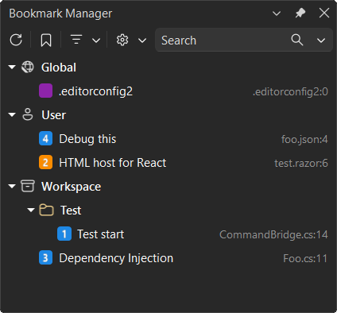
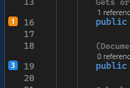

[marketplace]: <https://marketplace.visualstudio.com/items?itemName=MadsKristensen.BookmarkStudio>
[vsixgallery]: <https://www.vsixgallery.com/extension/BookmarkStudio.7ed28d42-37b3-4773-8a6e-e9ca6403a0fc>
[repo]: <https://github.com/madskristensen/BookmarkStudio>

# Bookmark Studio for Visual Studio

Download this extension from the [Visual Studio Marketplace][marketplace]
or get the latest CI build from [Open VSIX Gallery][vsixgallery].

--------------------------------------

**Bookmark Studio helps you manage bookmarks across your entire solution, not just the current file.**

## Key Features at a Glance

- **Solution-wide Bookmark Manager** - View all bookmarks in one place
- **Folder organization** - Group bookmarks into folders with drag-and-drop support
- **Color-coded bookmarks** - Assign Blue, Red, Orange, Yellow, Green, Purple, Pink, or Teal
- **Quick slots (1-9)** - Auto-assign, reassign, clear, and jump directly to slot bookmarks
- **Built-in command interception** - Existing VS bookmark shortcuts work with Bookmark Studio
- **Fast navigation** - Go to next/previous bookmark and jump from the manager
- **Search and filtering** - Filter bookmarks by name, file, preview text, location, slot, or color
- **Editor glyphs** - Colored glyphs in the margin with contextual actions
- **Export options** - Export as plain text, Markdown, or CSV
- **Persistent metadata** - Saves labels, colors, slots, folders, and history per solution

## Why Bookmark Studio?

Visual Studio bookmarks are useful, but they can be hard to manage across larger solutions. Bookmark Studio adds a dedicated workflow for organizing, navigating, and exporting bookmarks with richer metadata, folder organization, and color support.

## Features

### Bookmark Manager Tool Window

Open **View > Bookmark Manager** to manage bookmarks in a dedicated tree view.

<!-- TODO: Add screenshot of the Bookmark Manager tool window showing the tree view with folders and bookmarks -->

- Search bookmarks by name, file, path, preview text, location, slot, or color
- Organize bookmarks into folders
- Navigate by double-click or context menu
- Edit label, assign/clear slot, set color, copy location, and delete bookmarks

### Folder Organization

Group related bookmarks into folders for better organization:

- Create folders from the toolbar or context menu
- Drag and drop bookmarks between folders
- Rename or delete folders from the context menu
- Folders persist with your bookmark data

<!-- TODO: Add screenshot showing folder organization with bookmarks grouped by feature or task -->

### Color Support

Each bookmark has a color and shows as a colored square in both:

- Bookmark Manager tree view
- Editor glyph margin

Available colors:

- Blue (default)
- Red
- Orange
- Yellow
- Green
- Purple
- Pink
- Teal

You can change color from:

- Bookmark Manager context menu (**Set Color**)
- Glyph context menu in the editor margin

### Slot-based Navigation (1-9)

Bookmark Studio supports quick-access slots:

- New bookmarks are auto-assigned the first available slot when possible
- Assign a bookmark to any slot from 1 to 9
- Reassigning a slot moves it to the selected bookmark
- Clear slot assignment without removing the bookmark
- Navigate directly with **Go To Bookmark Slot 1-9** commands

Default keybindings:

- **Alt+Shift+1** through **Alt+Shift+9**

### Built-in Bookmark Command Integration

Bookmark Studio intercepts Visual Studio built-in bookmark commands so existing workflows continue to work while using Bookmark Studio metadata and UI.

The following built-in commands are intercepted:

| Command | Default Shortcut | Description |
|---------|------------------|-------------|
| Toggle Bookmark | Ctrl+K, Ctrl+K | Toggle a bookmark at the current line |
| Next Bookmark | Ctrl+K, Ctrl+N | Navigate to the next bookmark in the solution |
| Previous Bookmark | Ctrl+K, Ctrl+P | Navigate to the previous bookmark in the solution |
| Next Bookmark in Document | Ctrl+Shift+K, Ctrl+Shift+N | Navigate to the next bookmark in the current document |
| Previous Bookmark in Document | Ctrl+Shift+K, Ctrl+Shift+P | Navigate to the previous bookmark in the current document |
| Clear Bookmarks in Document | Ctrl+Shift+K, Ctrl+Shift+L | Remove all bookmarks in the current document |

This means you can continue using your familiar keyboard shortcuts while benefiting from Bookmark Studio's enhanced features like colors, labels, folders, and slots.

### Tracking and Refresh

Bookmark Studio keeps bookmarks accurate as files change:

- Tracks bookmark positions as text moves
- Refreshes bookmark data when documents open, save, or focus changes
- Updates manager and glyphs as metadata changes

## Bookmark Metadata

Each bookmark stores:

- Slot number (optional)
- Label
- Color
- Folder path
- File path, line, and column location
- Line preview text
- Created timestamp
- Last visited timestamp

## Commands

Bookmark Studio provides commands for:

- Open Bookmark Manager
- Refresh Bookmark Manager
- Add Folder
- Toggle Bookmark Studio bookmark at caret
- Go to next Bookmark Studio bookmark
- Go to previous Bookmark Studio bookmark
- Go to bookmark slot 1 through 9
- Export bookmarks
- Delete selected bookmark (from manager toolbar)

## Storage

Bookmark Studio looks for `bookmarks.json` in the following order:

1. **Solution root** - `{solutionDirectory}/bookmarks.json`
2. **Repository root** - `{repoRoot}/bookmarks.json`
3. **Default (.vs folder)** - `{solutionDirectory}/.vs/bookmarks.json`

If no solution is loaded, Bookmark Studio uses a transient location under local app data.

### Sharing Bookmarks with Your Team

To share bookmarks with your team via source control:

1. Copy `.vs/bookmarks.json` to your solution root or repository root
2. Commit `bookmarks.json` to source control
3. Team members will automatically use the shared bookmarks file

This is useful for marking important code locations, onboarding landmarks, or review checkpoints that the whole team should see.

## Compatibility

- Visual Studio 2022
- x64 and Arm64 installations
- Requires the Visual Studio core editor component

## Contribute

[Issues](https://github.com/madskristensen/BookmarkStudio/issues), ideas, and pull requests are welcome.
